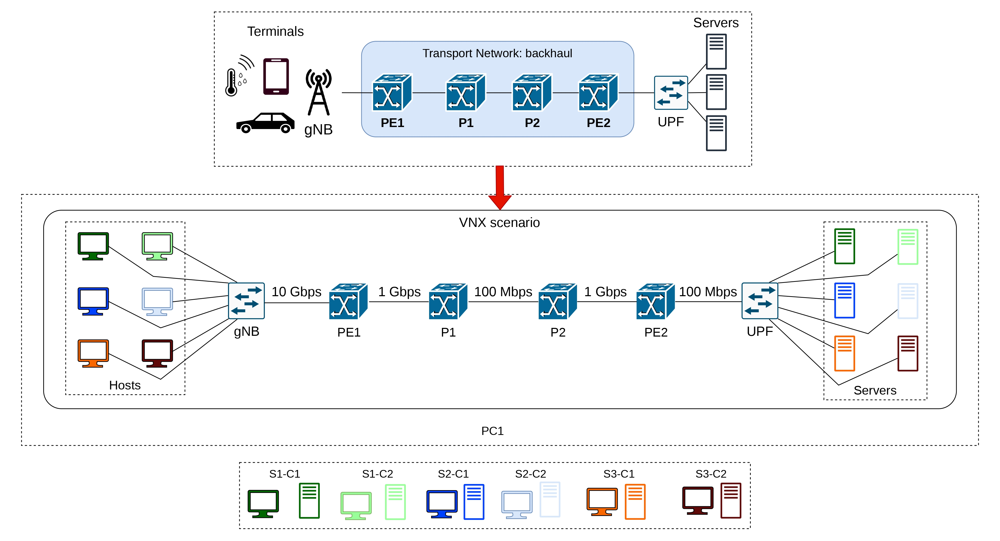

# Latency bounds scenario



## Deploy scenario

### Requirements

- python 3.11 (3.10 works also)
- iperf
- parallel
- tcpreplay
- vnx
- wireshark

```shell
pip install -r requirements.txt
```

> Better to use [`pyenv`](https://github.com/pyenv/pyenv) amd then a virtual environment

### VNX setup

If it's your first time with [VNX](https://web.dit.upm.es/vnxwiki/index.php/Main_Page) you'll probably need to modify the ubuntu image to install `iperf`. To do so you need to use the VNX [modify rootfs](https://web.dit.upm.es/vnxwiki/index.php/Vnx-modify-rootfs) command

```shell
sudo vnx --modify-rootfs vnx_rootfs_lxc_ubuntu64-24.04-v025
```
> user:password is `root:xxxx`
```shell
root@vnx: apt install iperf
root@vnx: halt -p
```

### Create the scenario

```shell
sudo vnx -f scenario.xml -t --no-console  # Create scenario
sudo vnx -f scenario.xml -x config_routers # Add default configuration 
```

> To attach a shell you need to do: `sudo lxc-console -n <HOSTNAME>`

### Destroy the scenario
```shell
sudo vnx -f scenario.xml --destroy # Destroy scenario
```

## Tests

### Experiment A

> If something goes wrong during the experiment: `sudo killall iperf`

1) Open 2 wiresharks on sudo mode
    ```shell
    sudo wireshark &
    ```

2) Capture on `PE1.e2` and `PE2-e2` and add the filter: `!icmp and udp`

3) Run the experiment.
    ```shell
    sudo iperf2.sh # iperf2_pl.sh is for packet losses example
    ```

4) End the capture and save both files as `ExperimentA/PE1.pcap` and `ExperimentA/PE2.pcap` respectively.

#### Packet losses

Run the `comparation.py` to see the packet losses.

### Experiment B

1) cd ExperimentB
2) Run traffic_gen.py
3) Run sudo ./captura.sh
4) sudo tcpreplay --intf1=PE1-e1 ExperimentB.pcap
5) Close captura.sh
6) python3 comparation.py